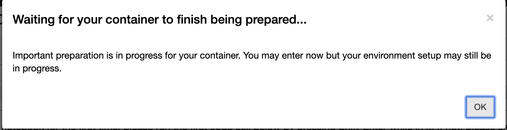

# 2019-Case-Builder
Use this repository to build case servers in BinderHub or Microsift Azure

 

## TLDR;
This is a set of [Jupyter Notebooks](https://jupyter.org/) to introduce **digital case studies**. Click on the BinderHub or the Azure Notebooks link above. Wait a few minutes for the binder or Microsoft Azure Notebook to complete its setup and launch. 

## For Microsoft Azure Notebook
1. To use Microsoft Azure Notebook to launch this GitHub repository, you need to create an account at https://notebooks.azure.com.
2. If you see the popup window below, this means the packages required to run notebooks are still being installed. The window will disappear when package installation is complete.

## Learn More About
1. [Project Jupyter](https://jupyter.org/)
2. [BinderHub technology - repo2docker](https://repo2docker.readthedocs.io/en/latest/)
3. [Microsoft Azure Notebooks](https://notebooks.azure.com/) and [QuickStart Documentation](https://docs.microsoft.com/en-us/azure/notebooks/)

**[Back to Digital Case Studies](https://github.com/PHI-Case-Studies)**
